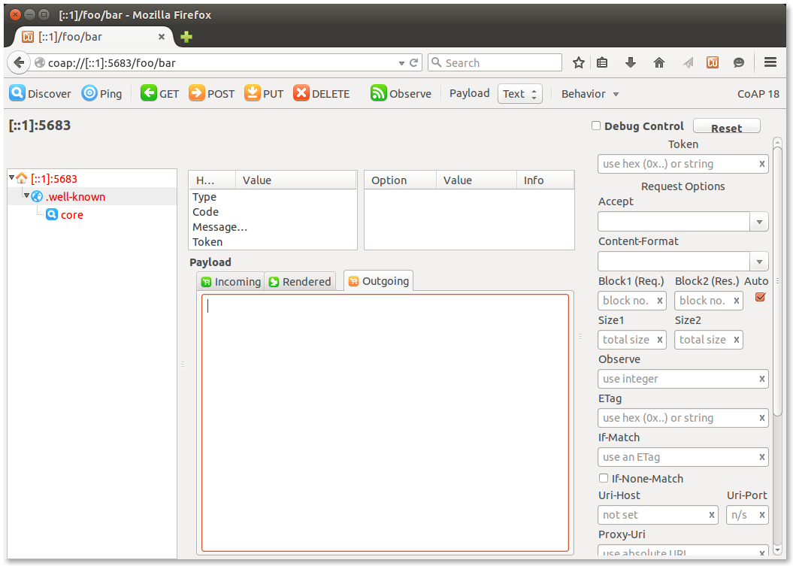
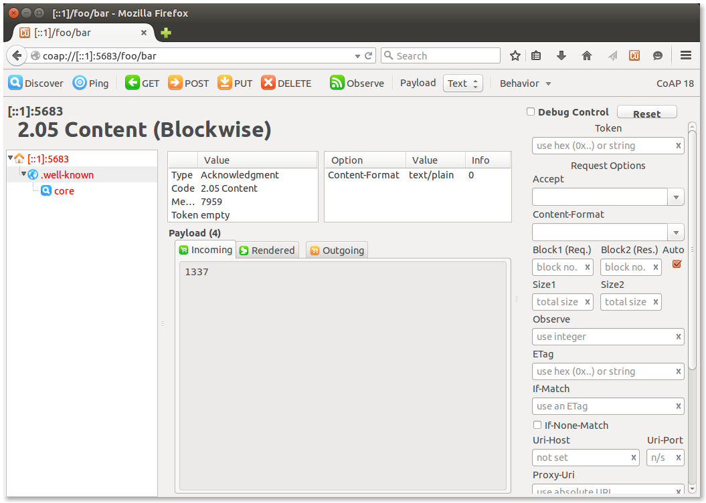

In [a previous post](http://watr.li/what-is-coap.html), we explained how the [Constrained Application Protocol (CoAP)](http://coap.technology) enables us to exchange data between nodes in the Internet of Plants using a request/reply cycle similar to that of HTTP. 
To do this, we need both of our node types– plant nodes and display nodes– to be able to send, process and answer CoAP requests.

This post explains how to implement a simple CoAP server on our *plant nodes*, which run [RIOT](http://www.riot-os.org), using RIOTs [microcoap](https://github.com/1248/microcoap) package. 

Since no special modifications to the code are needed to get it to run on RIOT, this guide may also be useful to you if you're looking to run microcoap on Linux or your Arduino.{: .alert .alert-info }

We'll also show you how to test your microcoap server with [Copper](https://addons.mozilla.org/de/firefox/addon/copper-270430/), using [marz](https://github.com/sgso/marz) to tunnel the requests to your RIOT instance.

## Implementing a simple microcoap server
This section will walk you through the implementation of a very simple microcoap server. In the end, you'll have a server which is able to answer ``GET`` requests to ``/foo/bar``, and (hopefully :) ) the knowledge how to extend this server at will. This guide is based on the code of [this example application](https://github.com/RIOT-OS/applications/tree/master/microcoap). It might be useful to keep an eye on it as a reference.  
Let's go through the code file by file.

### The Makefile
Note: this part is only relevant if you use RIOT. {: .alert .alert-info }

Even though [the RIOT wiki](https://github.com/RIOT-OS/RIOT/wiki/Creating-your-first-RIOT-project) has a more in-depth explanation of RIOT Makefiles, there is one thing that you shouldn't overlook:  
Each RIOT Makefile specifies the board the application should be built for using the ``BOARD`` parameter. [In the example Makefile](https://github.com/RIOT-OS/applications/blob/master/microcoap/Makefile), you'll find the following line:

    BOARD ?= native

This means that your application will be built as a *native* applications. the application and the RIOT instance it is running on will run inside a thread on your Linux OS, which is great for testing and debugging. Once you're ready to flash your code to your actual board, substitute ``native`` with the name of your board (in our case ``samr21-xpro``) and [flash it](http://watr.li/samr21-dev-setup-ubuntu.html).

Please note that microcoap currently doesn't have a nice API to create requests on its own (i.e. without being triggered by a client). It can be done, though, but that's for another blog post.  {: .alert .alert-info }

### endpoints.c
As explained in our , a CoAP server answers requests which are directed at the *resource* of a certain *endpoint* (namely, the IP address of our server). Our server will thus have to define the resources which can be requested, and how to handle these requests.  

Probably a bit confusingly named, microcoap handles this with the help of an array called ``endpoints``.
This array should *not* contain information about any endpoints (i.e. IP and port pairs), but information about your resources.  
You will have to create a ``const coap_endpoint_t endpoints[]`` and fill it to match your desired endpoints and how they should be handled. Let's look at this step by step.

In ``endpoints.c``, you will find that the example application has created an array of ``coap_endpoint_t`` called ``endpoints``:

	:c:
	const coap_endpoint_t endpoints[] =
	{
    	{COAP_METHOD_GET, handle_get_response, &path, "ct=0"},
    	{(coap_method_t)0, NULL, NULL, NULL} /* marks the end of the endpoints array */
	};

Now, if we look at the ``coap.h`` file of [the microcoap code](https://github.com/1248/microcoap/blob/master/coap.h#L138), we can see that a ``coap_endpoint_t`` is defined as follows:

    :c:
    typedef struct
    {
        coap_method_t method;               /* (i.e. POST, PUT or GET) */
        coap_endpoint_func handler;         /* callback function which handles this 
                                             * type of endpoint (and calls 
                                             * coap_make_response() at some point) */
        const coap_endpoint_path_t *path;   /* path towards a resource (i.e. foo/bar/) */ 
        const char *core_attr;              /* the 'ct' attribute, as defined in RFC7252, section 7.2.1.:
                                             * "The Content-Format code "ct" attribute 
                                             * provides a hint about the 
                                             * Content-Formats this resource returns." 
                                             * (Section 12.3. lists possible ct values.) */
    } coap_endpoint_t;

This helps us understand the first entry of our ``endpoints[]``.  

- ``COAP_METHOD_GET`` specifies that this entry describes how to handle a ``GET`` request.
- ``handle_get_response`` is the function which should be called in case a suitable request has been received.
- ``&path`` is a pointer towards the path that specifies the resource which is handled by this entry. ``path`` is defined as  
		
		static const coap_endpoint_path_t path = {2, {"foo", "bar"}};		
a few lines up, so we know that this entry handles a path which contains two segments, namely ``/foo/bar``.

microcoap supports a maximum segment number of two out of the box. If you need more, you'll have to adjust ``MAX_SEGMENTS`` in ``coap.h``.{: .alert .alert-warning }

- ``"ct=0"`` Specifies the Content-Format, which is a hint on how to interpret the payload of the packet (if any). In this case, the content format is 0, which stands for ``text/plain``
 A list of possible Content-Format types can be found in [section 12.3 of the CoAP RFC](https://tools.ietf.org/html/rfc7252#section-12.3).

If our CoAP server receives a request which matches this definition, i.e. a ``GET`` request to ``/foo/bar/`` with the Content-Format set to ``0=text/plain``, the ``handle_get_response()`` function will be called, which handles the processing of this request and the creation of a response, if necessary. Let's look at this function in detail:

	:c:
	void create_response_payload(const uint8_t *buffer)
    {
        char *response = "1337";
        memcpy((void*)buffer, response, strlen(response));
    }

    /* The handler which handles the path /foo/bar */
    static int handle_get_response(coap_rw_buffer_t *scratch, const coap_packet_t *inpkt, coap_packet_t *outpkt, uint8_t id_hi, uint8_t id_lo)
    {
        DEBUG("[endpoints]  %s()\n",  __func__);
        create_response_payload(response);
        /* NOTE: COAP_RSPCODE_CONTENT only works in a packet answering a GET. */
        return coap_make_response(scratch, outpkt, response, strlen((char*)response),
                                  id_hi, id_lo, &inpkt->tok, COAP_RSPCODE_CONTENT, COAP_CONTENTTYPE_TEXT_PLAIN);
    }

Whenever a callback function that is defined in an ``coap_endpoint_t`` is called, it is provided with parameters. Let's look at the ones that may be important to you.  

- ``const coap_packet_t *inpkt`` Is a pointer to the packet which caused this callback to be called. This way, your callback function can examine its content and determine how it should react. 
- ``coap_packet_t *outpkt`` Is a pointer to the buffer into which a response packet can be written. 
- ``uint8_t id_hi`` and ``uint8_t id_lo`` Are, when put together, the CoAP Message ID. These Message IDs are used to detect duplicate packets or to match Acknowledgement packets to the requests that triggered them. 

Because ``handle_get_response()`` handles a ``GET`` request, we want our ``handle_get_response()`` to react with a response. So we've whipped up a little function called ``create_response_payload()``, which creates the payload of our response. Then, we use ``coap_make_response()`` to build our packet:

- The struct that the ``outpkt`` pointer points to is filled with fresh data.
- The data behind ``response`` is incorporated into ``outpkt`` as payload.
- ``id_hi`` and ``id_lo`` are echoed back to help our client match the response to its request.
- ``COAP_RSPCODE_CONTENT`` sets the message response code to ``2.05 Content``.
- ``COAP_CONTENTTYPE_TEXT_PLAIN`` sets the media type to ``text/plain``.

When this is done, ``handle_get_response()`` returns the response code that ``coap_make_response()`` gave us, so that ``main.c`` knows if our endeavors were successful.

As you can see, ``create_response_payload()`` is as simple as it gets in this example. In a real application, however, this might be where you'll read out sensor data which has been requested.

Note that microcoap will recognize the endpoints array by its name. This will **not** work if your array is called anything but ``endpoints``!{: .alert .alert-warning }

### main.c
Now, let's see how we can use our newly-defined endpoints to handle requests.
For an in-depth explanation of the structure of a RIOT application, please [see this RIOT wiki page](https://github.com/RIOT-OS/RIOT/wiki/Creating-your-first-RIOT-project){: .alert .alert-info }

I'm assuming you're familiar with sockets and writing simple servers, so let's skip right to the interesting part, which starts at line 118:  
    
    :c:
    if (0 != (rc = coap_parse(&pkt, buf, n)))
        printf("Bad packet rc=%d\n", rc);

checks whether the packet we received is actually a valid CoAP packet.

    :c:
    else
    {
        size_t rsplen = sizeof(buf);
        coap_packet_t rsppkt;
        printf("content:\n");
        coap_dumpPacket(&pkt);
        coap_handle_req(&scratch_buf, &pkt, &rsppkt);

After the packet passes this test, it is passed to ``coap_handle_req()``. If the method and path of the request match one of the method-path combinations we specified in ``endpoints[]`` earlier on, the ``coap_endpoint_func handler`` provided along with them will be called automagically. The resulting response packet is written into ``rsppkt``.

    :c:
    if (0 != (rc = coap_build(buf, &rsplen, &rsppkt)))
        printf("coap_build failed rc=%d\n", rc);

Now, the response packet ``rsppkt`` we just built is serialized and written to ``buf`` so that we can send it through our socket. Note that we also pass a *pointer* to ``rsplen``: This doesn't just tell ``coap_build()`` the size of our buffer. When ``coap_build()`` is done, it will have written the actual CoAP packet size to ``rsplen``. This way, we can avoid sending bogus data which fills the rest of ``buf`` by providing our send function with ``rsplen`` as the buffer size indicator:

    :c:
    else
    {
        printf("Sending packet: ");
        coap_dump(buf, rsplen, true);
        printf("\n");
        printf("content:\n");
        coap_dumpPacket(&rsppkt);
        socket_base_sendto(sock_rcv, buf, rsplen, 0, &sa_rcv, sizeof(sa_rcv));
    }

And that's it! We've now successfully received, processed and answered a CoAP request.

## Testing your microcoap server
Now that our microcoap server is up and running, we'll want to feed it requests and see if it behaves as expected. This section will guide you through the setup of a simple environment which lets you do this. (Despite the somewhat misleading terminology, this section is *not* about thorough, automated tests.)

### marz: feeding RIOT traffic from the outside
Note: this part is only relevant if you use RIOT. {: .alert .alert-info }
<!-- TODO: what about 6lowpan? -->

Because instances of RIOT's native port are just Linux threads, they lack a real, physical network. Native emulates this missing network through the use of tapbridges. This means that every RIOT native thread is attached to a tap device, which it assumes to be the network device through which all network traffic is sent and received. In order to get the CoAP requests we're sending with Copper through to our RIOT instance, we'll have to tunnel them into RIOT's emulated tap network. The following section will show you how to use [marz](https://github.com/sgso/marz) to accomplish this.

1. Run `sudo apt-get install bridge-utils`
2. In your RIOT directury, run

	./cpu/native/tapsetup.sh create 2

This will set up two tap devices connected by a bridge. our RIOT application and 
marz will each listen at one of these devices, and communicate over the bridge.

3. Open two terminal windows.  

**In window #1**, build and start the microcoap-example application:

    cd applications/microcoap
    make
    sudo ./bin/native/microcoap-example.elf tap1 -i 1

Make sure to bind it to ``tap1``, since marz will be bound to ``tap0``! {: .alert .alert-info } 
``-i 1`` forces your RIOT instance to match its id to the one specified in marz.config. You should **only** specify this for the **one** RIOT that marz tunnels to. This is sufficient for this example; if you need help running more than one RIOT with marz, please contact the author of this example.

You should see output similar to this.

    RIOT native uart0 initialized.
    RIOT native interrupts/signals initialized.
    LED_GREEN_OFF
    LED_RED_ON
    RIOT native board initialized.
    RIOT native hardware initialization complete.

    kernel_init(): This is RIOT! (Version: 400e-microcoap)
    kernel_init(): jumping into first task...
    UART0 thread started.
    uart0_init() [OK]
    Initializing transport layer protocol: udp
    Starting example microcoap server...
    initializing 6LoWPAN...
    initializing receive socket...
    Ready to receive requests.

**In window #2**, first install Python development headers by running

    sudo apt-get install python-dev

Afterwards you can install and run marz:
    
    pip install --user Twisted && 
    pip install --user bidict && 
    git clone https://github.com/sgso/marz &&
    cd marz &&
    ./setup.sh 

    ./marz.py

You should see output similar to this.

    WARNING: No route found for IPv6 destination :: (no default route?)
    Listening on UDP ports: [5683, 2222]
    Listening on tap interface tap0 with MAC address 9a:80:a3:fc:93:18

Marz is now ready to tunnel all traffic sent to the IPv6 localhost address ``::1`` on port ``5683``

### Setting up a test client
If you already have a CoAP client which you can use to send requests, that's great. In case you don't, [Copper](https://addons.mozilla.org/de/firefox/addon/copper-270430/) is here to help: Simply install the Copper plugin in your Firefox browser and enter 

    coap://[::1]:5683/foo/bar

into the browser. 5683 is the standard CoAP port. If your server runs on any address other than localhost, make sure to swap out ``::1`` for the correct address, and bear in mind that only IPv6 addresses need to be surrounded by square brackets!
Your browser window should show the following:

Now you can click the big green ``GET`` button. This will send a GET request to the resource ``foo/bar/`` of our microcoap server. Our server should reply with a ``2.05 Content`` message containing the payload ``1337``, which Copper should display like this:

