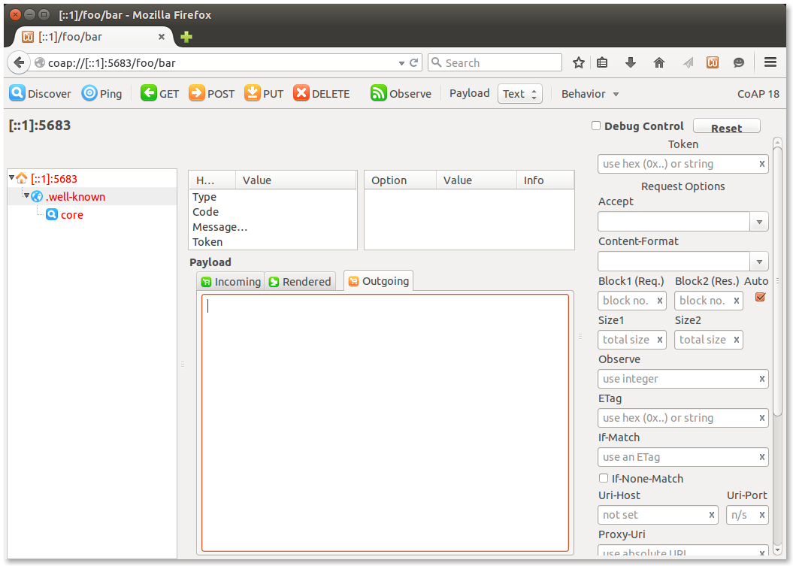
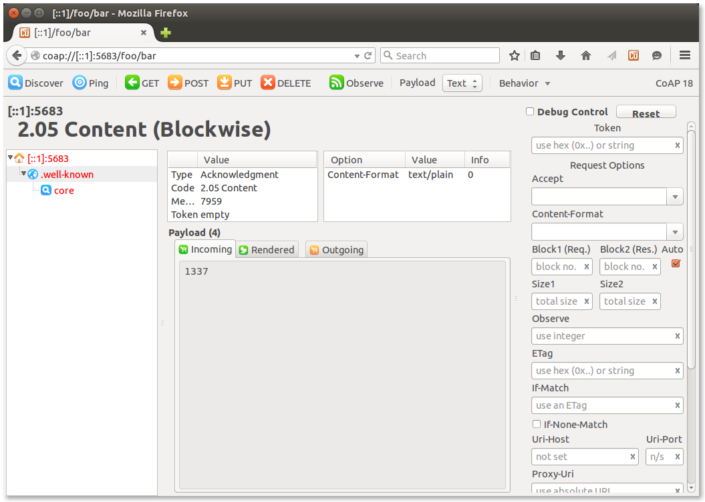

Note: A previous version of this post linked to a now deprecated microcoap example
application for RIOT. The old version also contained instructions for using [marz](https://github.com/sgso/marz), which is now deprecated as well. You can find the old version of this post [here](https://github.com/watr-li/blog/blob/5c5877391fb38cb012dc6f75e0d87cb26831176c/_posts/2015-10-02-microcoap-and-ff-copper.md).
{: .alert .alert-warning }

In [a previous post](http://watr.li/what-is-coap.html), we explained how the [Constrained Application Protocol (CoAP)](http://coap.technology) enables us to exchange data between nodes in the Internet of Plants using a request/reply cycle similar to that of HTTP.
To do this, we need both of our node types– plant nodes and display nodes– to be able to send, process and answer CoAP requests.

This post explains how to implement a simple CoAP server on our *plant nodes*, which run [RIOT](http://www.riot-os.org), using RIOTs [microcoap](https://github.com/1248/microcoap) package.

Since no special modifications to the code are needed to get it to run on RIOT, this guide may also be useful to you if you're looking to run microcoap on Linux or your Arduino.
{: .alert .alert-info }

We'll also show you how to test your microcoap server with [Copper](https://addons.mozilla.org/de/firefox/addon/copper-270430/).

<!-- more -->

## Implementing a small microcoap server
This section will walk you through the implementation of a very small microcoap server. In the end, you'll have a server which is able to answer ``GET`` requests to ``/riot/board``, and (hopefully :) ) the knowledge how to extend this server at will. This guide is based on the code of [this example application](https://github.com/RIOT-OS/RIOT/tree/master/examples/microcoap_server). It might be useful to keep an eye on it as a reference.
Let's go through the code file by file.

### The Makefile
Note: this part is only relevant if you use RIOT.
{: .alert .alert-info }

Even though [the RIOT wiki](https://github.com/RIOT-OS/RIOT/wiki/Creating-your-first-RIOT-project) has a more in-depth explanation of RIOT Makefiles, there is one thing that you shouldn't overlook:
Each RIOT Makefile specifies the board the application should be built for using the ``BOARD`` parameter. [In the example Makefile](https://github.com/RIOT-OS/RIOT/blob/master/examples/microcoap_server/Makefile), you'll find the following line:

    BOARD ?= native

This means that your application will be built as a *native* applications. the application and the RIOT instance it is running on will run inside a thread on your Linux OS, which is great for testing and debugging. Once you're ready to flash your code to your actual board, substitute ``native`` with the name of your board (in our case ``samr21-xpro``) and [flash it](http://watr.li/samr21-dev-setup-ubuntu.html).

Please note that microcoap currently doesn't have a nice API to create requests on its own (i.e. without being triggered by a client). It can be done, though, but that's for another blog post.
{: .alert .alert-info }

### endpoints.c

As explained in our , a CoAP server answers requests which are directed at the *resource* of a certain *endpoint* (namely, the IP address of our server). Our server will thus have to define the resources which can be requested, and how to handle these requests.

Probably a bit confusingly named, microcoap handles this with the help of an array of type ``endpoints``.
This array should *not* contain information about any endpoints (i.e. IP and port pairs), but information about your resources.
You will have to create a ``const coap_endpoint_t endpoints[]`` and fill it to match your desired endpoints and how they should be handled. Let's look at this step by step.

In ``microcoap_server/coap.c``, you will find that the example application has created an array of ``coap_endpoint_t`` called ``endpoints``:

~~~c
const coap_endpoint_t endpoints[] =
{
    { COAP_METHOD_GET,  handle_get_well_known_core,
      &path_well_known_core, "ct=40" },
    { COAP_METHOD_GET,  handle_get_riot_board,
      &path_riot_board,    "ct=0"  },
    /* marks the end of the endpoints array: */
    { (coap_method_t)0, NULL, NULL, NULL }
};
~~~

For simplicity's sake, we'll only be looking at the second entry from now on.

Now, if we look at the ``coap.h`` file of [the microcoap code](https://github.com/1248/microcoap/blob/master/coap.h#L138), we can see that a ``coap_endpoint_t`` is defined as follows:

~~~c
typedef struct
{
    coap_method_t method;              /* (i.e. POST, PUT or GET) */
    coap_endpoint_func handler;         /* callback function which
                                         * handles this type of
                                         * endpoint (and calls
                                         * coap_make_response()
                                         * at some point) */
    const coap_endpoint_path_t *path; /* path towards a resource
                                         * (i.e. foo/bar/) */
    const char *core_attr;             /* the 'ct' attribute,
                                         * as defined in RFC7252,
                                         * section 7.2.1.:
                                         * "The Content-Format code
                                         * "ct" attribute provides
                                         * a hint about the
                                         * Content-Formats this
                                         * resource returns."
                                         * (Section 12.3. lists
                                         * possible ct values.) */
} coap_endpoint_t;
~~~
{: .wide }

This helps us understand the entries of our ``endpoints[]``.

- ``COAP_METHOD_GET`` specifies that this entry describes how to handle a ``GET`` request.
- ``handle_get_response`` is the function which should be called in case a suitable request has been received.
- ``&path`` is a pointer towards the path that specifies the resource which is handled by this entry. ``path`` is defined as

~~~c
static const coap_endpoint_path_t path_riot_board = { 2, { "riot", "board" } };
~~~
{: .wide }

a few lines up, so we know that this entry handles a path which contains two segments, namely ``/riot/board``.

microcoap supports a maximum segment number of two out of the box. If you need more, you'll have to adjust ``MAX_SEGMENTS`` in ``coap.h``.
{: .alert .alert-warning }

- ``"ct=0"`` Specifies the Content-Format, which is a hint on how to interpret the payload of the packet (if any). In this case, the content format is 0, which stands for ``text/plain``
 A list of possible Content-Format types can be found in [section 12.3 of the CoAP RFC](https://tools.ietf.org/html/rfc7252#section-12.3).

If our CoAP server receives a request which matches this definition, i.e. a ``GET`` request to ``/riot/board/`` with the Content-Format set to ``0=text/plain``, the ``handle_get_riot_board()`` function will be called, which handles the processing of this request and the creation of a response, if necessary. Let's look at this function in detail:

~~~c
static int handle_get_riot_board(coap_rw_buffer_t *scratch,
        const coap_packet_t *inpkt, coap_packet_t *outpkt,
        uint8_t id_hi, uint8_t id_lo)
{
    const char *riot_name = RIOT_BOARD;
    int len = strlen(RIOT_BOARD);

    memcpy(response, riot_name, len);

    return coap_make_response(scratch, outpkt,
                             (const uint8_t *)response, len,
                              id_hi, id_lo, &inpkt->tok,
                              COAP_RSPCODE_CONTENT,
                              COAP_CONTENTTYPE_TEXT_PLAIN);
}
~~~
{: .wide }

Whenever a callback function that is defined in an ``coap_endpoint_t`` is called, it is provided with parameters. Let's look at the ones that may be important to you.

- ``const coap_packet_t *inpkt`` Is a pointer to the packet which caused this callback to be called. This way, your callback function can examine its content and determine how it should react.
- ``coap_packet_t *outpkt`` Is a pointer to the buffer into which a response packet can be written.
- ``uint8_t id_hi`` and ``uint8_t id_lo`` Are, when put together, the CoAP Message ID. These Message IDs are used to detect duplicate packets or to match Acknowledgement packets to the requests that triggered them.

Because ``handle_get_riot_board()`` handles a ``GET`` request, we want this function to answer with a response value. So we're copying the current BOARD name into ``response[]``.
Then, we use ``coap_make_response()`` to build our packet:

- The struct that the ``outpkt`` pointer points to is filled with fresh data.
- The data behind ``response`` is incorporated into ``outpkt`` as payload.
- ``id_hi`` and ``id_lo`` are echoed back to help our client match the response to its request.
- ``COAP_RSPCODE_CONTENT`` sets the message response code to ``2.05 Content``.
- ``COAP_CONTENTTYPE_TEXT_PLAIN`` sets the media type to ``text/plain``.

When this is done, ``handle_get_riot_board()`` returns the response code that ``coap_make_response()`` gave us, so that ``main.c`` knows if our endeavors were successful.

As you can see, our response payload in this example is very simple. In a real application, however, this might be where you'll read out sensor data which has been requested.

Note that microcoap will recognize the endpoints array by its name. This will **not** work if your array is called anything but ``endpoints``!
{: .alert .alert-warning }

### microcoap_conn.c
Now, let's see how we can use our newly-defined endpoints to handle requests.
For an in-depth explanation of the structure of a RIOT application, please [see this RIOT wiki page](https://github.com/RIOT-OS/RIOT/wiki/Creating-your-first-RIOT-project)
{: .alert .alert-info }

You'll see that `microcoap_server_loop()` starts with calls to ``conn_udp_create()`` and ``conn_udp_recvfrom()``. This is RIOT-specific code to set up and receive from a UDP connection and can be substituted with regular POSIX socket code, if that's what you need.

The interesting part starts at line 60:

~~~c
/* parse UDP packet to CoAP */
if (0 != (rc = coap_parse(&pkt, _udp_buf, n))) {
    DEBUG("Bad packet rc=%d\n", rc);
}
~~~

checks whether the packet we received is actually a valid CoAP packet.

~~~c
else
{
    coap_packet_t rsppkt;
    DEBUG("content:\n");
    coap_dumpPacket(&pkt);

    /* handle CoAP request */
    coap_handle_req(&scratch_buf, &pkt, &rsppkt);
}
~~~

After the packet passes this test, it is passed to ``coap_handle_req()``. If the method and path of the request match one of the method-path combinations we specified in ``endpoints[]`` earlier on, the ``coap_endpoint_func handler`` provided along with them (in our case, this is ``handle_get_riot_board``) will be called automagically. The resulting response packet is written into ``rsppkt``.

~~~c
/* build reply */
size_t rsplen = sizeof(_udp_buf);
if ((rc = coap_build(_udp_buf, &rsplen, &rsppkt)) != 0) {
    DEBUG("coap_build failed rc=%d\n", rc);
}
~~~

Now, the response packet ``rsppkt`` we just built is serialized and written to ``buf`` so that we can send it. Note that we also pass a *pointer* to ``rsplen``: This doesn't just tell ``coap_build()`` the size of our buffer. When ``coap_build()`` is done, it will have written the actual CoAP packet size to ``rsplen``. This way, we can avoid sending bogus data which fills the rest of ``buf`` by providing our send function with ``rsplen`` as the buffer size indicator:

~~~c
else {
    DEBUG("Sending packet: ");
    coap_dump(_udp_buf, rsplen, true);
    DEBUG("\n");
    DEBUG("content:\n");
    coap_dumpPacket(&rsppkt);

    /* send reply via UDP */
    rc = conn_udp_sendto(_udp_buf, rsplen, NULL, 0, raddr, raddr_len,
                         AF_INET6, COAP_SERVER_PORT, rport);
    if (rc < 0) {
        DEBUG("Error sending CoAP reply via udp; %u\n", rc);
    }
}
~~~
{: .wide}

And that's it! We've now successfully received, processed and answered a CoAP request.

## Testing your microcoap server
Now that our microcoap server is up and running, we'll want to feed it requests and see if it behaves as expected. This section will guide you through the setup of a simple environment which lets you do this. (Despite the somewhat misleading terminology, this section is *not* about thorough, automated tests.)

### Using Copper as a test client
[Copper](https://addons.mozilla.org/de/firefox/addon/copper-270430/), is a Firefox plugin that turns your browser into a powerful CoAP client.

### radvd: making RIOT available to Copper
<!--
TODO: remarks about missing zone indices etc.. you only need this if you use copper (or anything else that doesnt understand them ^^)
-->

If your microcoap application is running on RIOT native, there are some extra hoops to jump through before you can test it with Copper (in case you don't use RIOT, skip this subsection).

Make sure you've installed the Router Advertisement Daemon (`radvd`).

Build the application again using `make`.

Enter the following into your `/etc/radvd.conf` (if it doesn't exist yet, create one):

~~~
interface tap0
{
    AdvSendAdvert on;

    MinRtrAdvInterval 3;
    MaxRtrAdvInterval 10;

    AdvDefaultPreference low;

    prefix 2001:db8:1:0::/64
    {
        AdvOnLink on;
        AdvAutonomous on;
        AdvRouterAddr off;
    };
};
~~~

(you can use `radvd -c` to check for syntax errors)

and run

    sudo radvd

Then, run the RIOT binary as usual:

    make term

Note that the output listing all configured interfaces contains a globally scoped
address, which you can now use to reach the RIOT instance via Copper.

After you've installed the Copper plugin in your Firefox browser and successfully set up `radvd`, start the microcoap application:

    $ make term

    RIOT native interrupts/signals initialized.
    LED_GREEN_OFF
    LED_RED_ON
    RIOT native board initialized.
    RIOT native hardware initialization complete.

    main(): This is RIOT! (Version: 2016.03-devel-145-g7da0d-ubuntu)
    RIOT microcoap example application
    Configured network interfaces:
    Iface  5   HWaddr: 62:fc:3c:5e:40:df
               MTU:1500  HL:64  RTR  RTR_ADV
               Source address length: 6
               Link type: wired
               inet6 addr: ff02::1/128  scope: local [multicast]
               inet6 addr: fe80::60fc:3cff:fe5e:40df/64  scope: local
               inet6 addr: ff02::1:ff5e:40df/128  scope: local [multicast]
               inet6 addr: ff02::2/128  scope: local [multicast]
               inet6 addr: 2001:db8:1:0:e42a:1aff:feca:10ec/64  scope: global

    Waiting for incoming UDP packet...
{: .wide}

Note the address marked as "scope: **global**". This is the address you'll use to communicate with your microcoap server using Copper.

**If the above doesn't work,** try manually adding a Global address to the tap0 interface:

    sudo service radvd start
    sudo ip address add 2001:db8:1::a/64 dev tap0
    make term

### Using Copper

Now, you can enter

    coap://[2001:db8:1:0:e42a:1aff:feca:10ec]/riot/board

into your Firefox address bar, where you should replace `2001:db8:1:0:e42a:1aff:feca:10ec` with your server's IPv6 address (for RIOT, tis is the "scope: global" address). If you use IPv4, remove the `[]`.

Your browser window should look similar to this:

<!--TODO update image -->

<!-- TODO update path, get results etc -->

Now you can click the big green ``GET`` button. This will send a GET request to the resource ``foo/bar/`` of our microcoap server. Our server should reply with a ``2.05 Content`` message containing the payload ``native``, which Copper should display in the big grey box, similar to the "1337" in this screenshot:

When all of this works, you're ready to go. Extend ``endpoints[]`` with your own methods and paths, create response payloads that actually make sense and build awesome stuff with your new CoAP server. Happy hacking!
